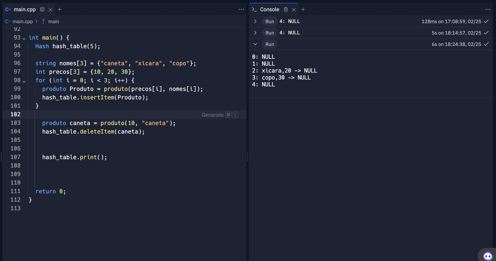

## Caso de teste 2: Insercao  
### Pré condição:  
A tabela hash está vazia.  
### Ação: 
Inserir três elementos: "caneta" com preço 10, "xicara" com preço 20 e "copo" com preço 30.  
### Resultado Esperado:  

Os elementos devem ser inseridos corretamente na tabela hash.  
### Verificação:  

Após a inserção, imprimir a tabela hash e verificar se os elementos estão corretamente armazenados.

 

## Caso de teste 2: Exclusao  
### Pré-condição:  
A tabela hash contém os elementos "caneta" com preço 10, "xicara" com preço 20 e "copo" com preço 30, dando foco ao elemento caneta.
### Ação:  
Remover o elemento "caneta" da tabela hash.
### Resultado Esperado:  
O elemento "caneta" deve ser removido corretamente da tabela hash.
### Verificação:
 
Após a remoção, imprimir a tabela hash e verificar se o elemento "caneta" não está mais presente.

 

## Caso de teste 3: Overflow  
### Pré-condição:  
A tabela hash tem capacidade para armazenar apenas 5 elementos.
### Ação:  
Inserir mais de 5 elementos na tabela para observar como ela lida com isso.
### Resultado Esperado:  
Como o número de elementos inseridos excede o tamanho máximo da tabela hash, alguns elementos ficam sem ter onde serem colocados. Mas como utilizamos encademaneto separado, o overflow gerado será eviado para para as células vizinhas.
### Verificação:
 
Imprimir a tabela hash e verificar como a tabela lida quando fica cheia.

 

## Caso de teste 4: Busca  
### Pré-condição:  
A tabela hash tem elementos inseridos nela, com foco em caneta.
### Ação:  
Procurar em qual posição da tabela hash caneta está e se ela existe dentro da tabela
### Resultado Esperado:  
Retornar a posição da tabela hash em que caneta está localizada, caso ela exista
### Verificação:
 
Imprimir se caneta existe na tabela hash ea posição de dela dentro da tabela hash 

 

## Caso de teste 5: Colisoes  
### Pré-condição:  
A tabela hash tem elementos que ocupam o mesmo slot e obersvar o funcionamento do tratamento de colisões.
### Ação:  
Inserir varios elementos que utilizariam o mesmo ID para ver como a tabela lida com isso
### Resultado Esperado:  
Retornar a tabela hash com diversos itens encadeados para observar o tratamento de colisões de encadeamento aberto.
### Verificação:
 
Imprimir a tabela hash e observar como o encadeamento separado está funcionando

 

